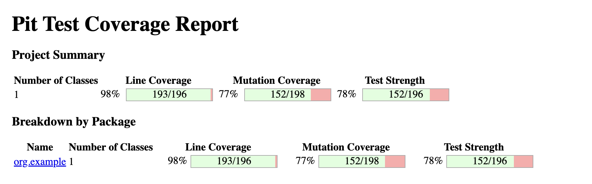

# Mutation Testing

## Tool Used

- PIT(Java):It provide test coverage for java.


## Designed Test cases
- We have write test cases for Arithmetic Operator Replacement (AOR),Relational Operator Replacement,Logical Operator Replacement,Shift Operator Replacement for unit testing and for Integration testing 
 we have write for Integration Parameter Variable Replacement,Integration Method Call Deletion,Integration Return Expression Modification.


## How to Run Tests

1.  **PIT Setup:**

    - Add PIT(Pitest) plugins and dependency in pom.xml.
3. **Running Mutation Tests**
   - Execute the following maven command:
     ```bash
     mvn org.pitest:pitest-maven:mutationCoverage
     ```
4. **Viewing Reports**
   - Navigate to the generated report in `target/pit-reports` directory
   - Open then `index.html` file in browser to view detailed mutation coverage and results.


## Test Results

Below is a screenshot of the mutation testing results:

